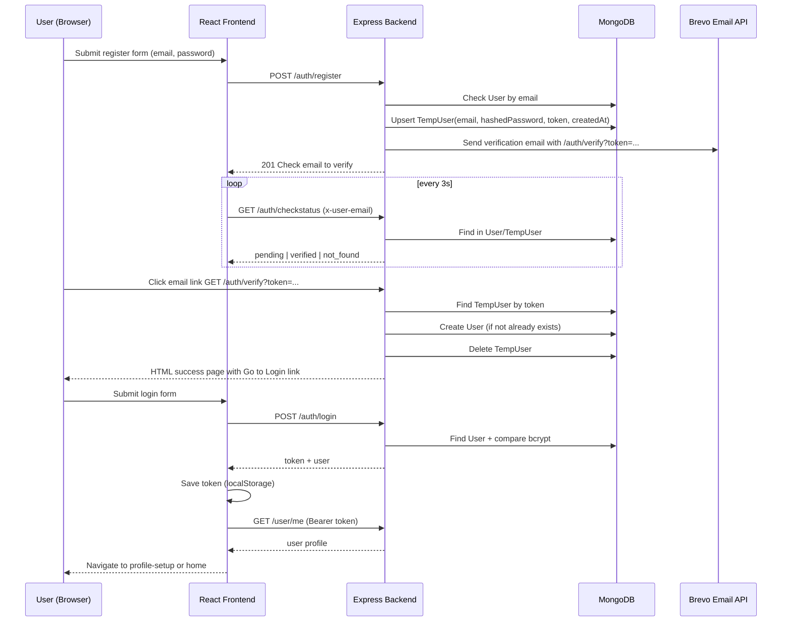
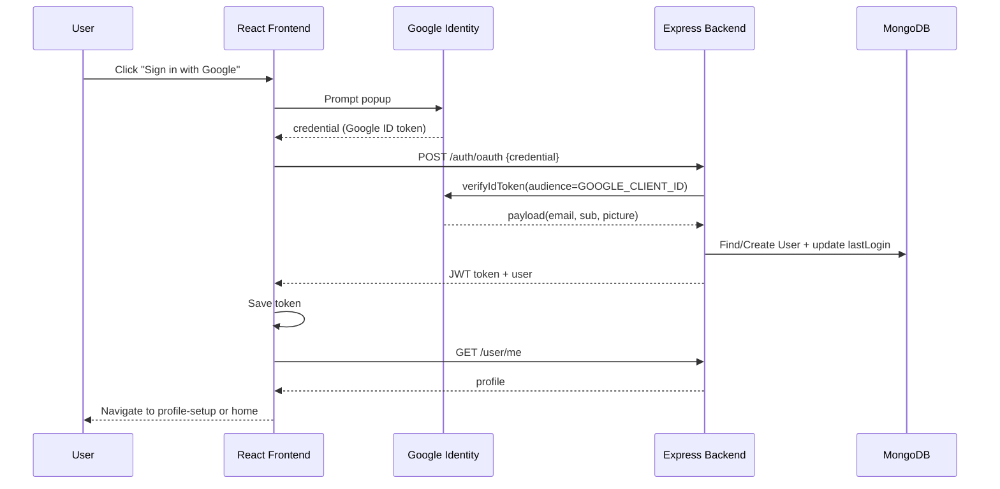
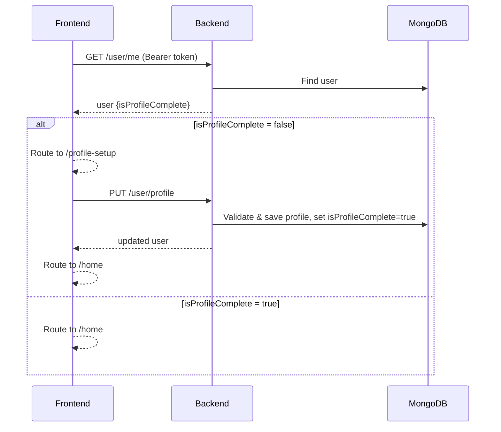

# Auth + Email Verification Master Guide

## Summary
This document has two goals:
1. Precisely document the **current authentication and email verification implementation** in this repository.
2. Provide a **reusable MERN-style blueprint** for implementing the same module in a new project.

No runtime code/API behavior is changed by this guide.

---

## 1) Current Project Deep Analysis

### 1.1 System Snapshot
- Backend stack: `Node.js + Express + Mongoose`.
- Frontend stack: `React + Vite + Axios + React Router`.
- Auth modes implemented:
1. Email/password registration + email verification + login.
2. Google OAuth login (`credential` token verification server-side).
- Session style: stateless JWT access token (`Bearer`), stored in browser localStorage.

Primary files reviewed:
- Backend:
  - `Backend/src/routes/authRoutes.js`
  - `Backend/src/controllers/authController.js`
  - `Backend/src/services/emailService.js`
  - `Backend/src/middlewares/authMiddleware.js`
  - `Backend/src/models/User.js`
  - `Backend/src/models/TempUser.js`
  - `Backend/src/controllers/userController.js`
  - `Backend/src/server.js`
- Frontend:
  - `frontend/src/api/auth.js`
  - `frontend/src/services/httpClient.js`
  - `frontend/src/utils/authStorage.js`
  - `frontend/src/pages/LoginPage.jsx`
  - `frontend/src/pages/RegisterPage.jsx`
  - `frontend/src/components/auth/VerifyPanel.jsx`
  - `frontend/src/components/ProtectedRoute.jsx`
  - `frontend/src/App.jsx`

---

### 1.2 Current Auth API Contracts (As Implemented)

Base backend URL is `VITE_API_BASE_URL` on frontend, default fallback `http://localhost:5000`.

#### `POST /auth/register`
- Purpose: Create/update pending registration record and send verification email.
- Request body:
```json
{
  "email": "user@example.com",
  "password": "plainPassword"
}
```
- Validation:
  - Requires both fields.
  - Email normalized to lowercase/trim and regex-validated.
  - Rejects if `User` already exists (`400`).
- Behavior:
  - Hashes password with `bcrypt.hash(..., 10)`.
  - Upserts `TempUser` with new UUID token and new `createdAt`.
  - Sends email via Brevo API.
- Success response: `201 { "message": "Check email to verify" }`.
- Error examples:
  - `400`: missing/invalid inputs, existing email.
  - `500`: registration fail or email provider API fail.

#### `GET /auth/verify?token=...`
- Purpose: Verify email by token and promote pending user to permanent user.
- Query params: `token` (required).
- Behavior:
  - Looks up `TempUser` by token.
  - If token missing/invalid -> `400`.
  - If matching user already exists in `User`, deletes `TempUser`, returns success.
  - Else creates `User` with `email + hashed password`, then deletes `TempUser`.
- On success, returns an HTML page confirming the email is verified and showing a `Go to Login` link.
- The login link uses `FRONTEND_BASE_URL`; if unset, it uses the first configured `ALLOWED_ORIGINS` origin, then falls back to `http://localhost:5173`.
- Error handling:
  - Duplicate key race (`code 11000`) also returns success `200` (idempotent-ish behavior).

#### `POST /auth/login`
- Purpose: Email/password login.
- Request body:
```json
{
  "email": "user@example.com",
  "password": "plainPassword"
}
```
- Validation:
  - Requires `JWT_SECRET` env.
  - Requires email/password and valid email format.
- Behavior:
  - Finds `User` by normalized email.
  - Rejects if no user or no password (OAuth-only account) with `401 Invalid credentials`.
  - Compares bcrypt hash.
  - Updates `lastLogin`.
  - Issues JWT (`expiresIn: 7d`) containing `{ userId, email }`.
- Success response:
```json
{
  "message": "Login successful",
  "token": "<jwt>",
  "user": {
    "id": "...",
    "email": "...",
    "name": "...",
    "isProfileComplete": false
  }
}
```
- Error examples: `400`, `401`, `500`.

#### `POST /auth/oauth`
- Purpose: Google OAuth login.
- Request body:
```json
{
  "credential": "<google_id_token>"
}
```
- Validation:
  - Requires `GOOGLE_CLIENT_ID` and `JWT_SECRET`.
- Behavior:
  - Verifies Google ID token using `google-auth-library`.
  - Extracts `email`, `sub` (oauthId), and `picture`.
  - If user exists: updates `lastLogin`.
  - Else creates user with `oauthProvider: "google"`, `oauthId`, `profilePic`.
  - Issues same 7d JWT.
- Success response:
```json
{
  "message": "OAuth login successful",
  "token": "<jwt>",
  "user": { "id": "...", "email": "..." }
}
```

#### `GET /auth/me` (protected)
- Auth header required: `Authorization: Bearer <token>`.
- Uses `authMiddleware`.
- Returns normalized user profile payload.

#### `GET /auth/checkstatus` (also alias `/auth/check-verify`)
- Purpose: polling endpoint for verification status UI.
- Input: header `x-user-email: user@example.com`.
- CORS allows this header so the frontend can poll the backend from its configured origin.
- Status logic:
  - If email in `User` -> `{ verified: true, status: "verified" }`
  - Else if in `TempUser` -> `{ verified: false, status: "pending" }`
  - Else -> `{ verified: false, status: "not_found" }`

#### `POST /auth/resend`
- Request body: `{ "email": "user@example.com" }`
- Behavior:
  - Rejects if already in `User` (`409`).
  - Requires pending `TempUser` (`404` if absent).
  - Rotates verification token + resets `createdAt`.
  - Re-sends verification email.
- Success: `200 { "message": "Verification email resent" }`.

#### `POST /auth/logout`
- Current behavior: returns `200 { "message": "Logout successful" }`.
- Note: no server token invalidation; frontend token removal controls effective logout.

---

### 1.3 Backend Logic Flow

#### Registration and verification pipeline
1. Receive `email/password`.
2. Normalize + validate email.
3. Check permanent `User` duplication.
4. Hash password.
5. Upsert `TempUser` with new token and TTL-backed `createdAt`.
6. Send verification email with `<verification-base-url>/auth/verify?token=...`, where `EMAIL_VERIFICATION_BASE_URL` overrides `BACKEND_BASE_URL`.
7. On verify endpoint hit, promote pending record into `User`, remove `TempUser`, and show the HTML success page with a login link.

#### JWT auth middleware flow
1. Read `Authorization` header.
2. Validate `Bearer` format.
3. Verify JWT using `JWT_SECRET`.
4. Attach normalized identity to `req.user` (`_id`, `id`, `userId`, `email`).
5. Continue or return `401`.

#### Profile completion gating
- After login/oauth, frontend calls `/user/me` and checks `isProfileComplete`.
- If false -> route to `/profile-setup`.
- If true -> route to `/home`.
- On profile submit, backend enforces required setup constraints and sets `isProfileComplete = true`.

---

### 1.4 Email Verification Service Details

Current service: `Backend/src/services/emailService.js`
- Provider: Brevo transactional email API (`https://api.brevo.com/v3/smtp/email`).
- Required env:
  - `BREVO_API_KEY`
  - `EMAIL_USER` (sender)
- Optional env:
  - `EMAIL_VERIFICATION_BASE_URL` (overrides the verification-link host).
  - `BACKEND_BASE_URL` (verification-link host fallback; default is `http://0.0.0.0:5000`).
  - `FRONTEND_BASE_URL` (base URL used by the verification success page's login link).
- Email contains plain text verification URL.

Error surface:
- Throws config error (`BREVO_CONFIG_MISSING`) when required env missing.
- Throws API error (`BREVO_API_ERROR`) when Brevo returns non-2xx.
- Controller catches these and returns `500` with provider issue message.

---

### 1.5 Current Schema Design

#### `User` collection
Key fields (auth-relevant):
- `email` (required, unique, lowercase, trim)
- `password` (optional for OAuth-only users)
- `oauthId`, `oauthProvider`
- `profilePic`, `lastLogin`, `createdAt`
- `isProfileComplete` + `preferences` + profile attributes

Interpretation:
- Supports both password and OAuth account paths.
- Single collection for all verified users.

#### `TempUser` collection
- `email` (required, unique)
- `password` (required, already hashed)
- `token` (required, unique)
- `createdAt` with `expires: 3600` (Mongo TTL index, target ~1 hour)

Token lifecycle:
- New token on register (upsert).
- New token on resend.
- Token consumed on `/auth/verify` and pending record deleted.
- If expired by TTL before verification, status eventually becomes `not_found`.

#### `VerifyToken` model
- Exists in repo but not used in active auth flow.

---

### 1.6 Frontend Authentication Flow

Main logic locations:
- `frontend/src/pages/LoginPage.jsx`
- `frontend/src/pages/RegisterPage.jsx`
- `frontend/src/components/auth/VerifyPanel.jsx`
- `frontend/src/services/httpClient.js`
- `frontend/src/utils/authStorage.js`
- `frontend/src/components/ProtectedRoute.jsx`

Flow details:
- Token persistence:
  - Stored in localStorage key `auth_token`.
  - User cache in `auth_user`.
- HTTP auth propagation:
  - Axios request interceptor injects `Authorization: Bearer <token>` when available.
- Route guard:
  - `ProtectedRoute` redirects to `/login` when token missing.

Verification UI (`VerifyPanel`):
- Polls `/auth/checkstatus` every 3 seconds.
- Shows an initial checking state, then pending, not_found, or verified state; transient request failures are shown while polling retries.
- On verified: success state then auto-calls `onVerified()` after 2s.
- Resend button:
  - Calls `/auth/resend`.
  - 10-second cooldown to prevent rapid repeated sends.

Google OAuth UI path:
- Loads Google Identity Services script in login page.
- Uses popup flow with `VITE_GOOGLE_CLIENT_ID`.
- Sends returned `credential` token to backend `/auth/oauth`.

---

### 1.7 End-to-End Sequence Diagrams (Current)

#### A) Email/Password Register -> Verify -> Login


#### B) Google OAuth Login


#### C) Profile Completion Gate


---

### 1.8 Failure / Edge-Case Matrix (Current)

| Scenario | Where handled | Current behavior | Client impact |
|---|---|---|---|
| Duplicate email at register (`User` exists) | `registerUser` | `400 Email already exists` | Show inline register error |
| Missing/invalid email format | register/checkstatus/resend/login | `400` validation error | Immediate correction required |
| Missing `JWT_SECRET` | login/oauth/auth middleware | `500` config error | Auth flows blocked |
| Missing `GOOGLE_CLIENT_ID` (backend) | `oauthLogin` | `500` config error | OAuth blocked |
| Missing `VITE_GOOGLE_CLIENT_ID` (frontend) | `LoginPage` | shows config status error | OAuth button non-functional |
| Missing Brevo env | `emailService` | throws config error -> `500` | Register/resend cannot send email |
| Brevo API non-2xx | `emailService` | `500` provider issue | User must retry later |
| Expired verification token (TTL cleanup) | `verifyEmail` lookup | `400 Invalid or expired token` | User should use resend flow |
| Resend for already verified email | `resendVerificationEmail` | `409 Email is already verified` | user should login |
| Resend for no pending record | `resendVerificationEmail` | `404 No pending verification` | restart registration |
| Password login for OAuth-only account | `loginUser` | `401 Invalid credentials` | must use OAuth or add password flow |
| Local logout only | frontend storage + `/auth/logout` | token cleared client-side; server keeps stateless | expected for JWT stateless model |

---

## 2) Reusable MERN Blueprint for New Project (Proposed)

This section is a **proposed blueprint**, not current repo behavior.

### 2.1 Recommended Module Architecture

```text
backend/
  src/
    modules/auth/
      auth.routes.js
      auth.controller.js
      auth.service.js
      auth.validation.js
      auth.types.js
    modules/email/
      email.service.js
      templates/
        verify-email.html
    modules/users/
      user.model.js
      user.service.js
    modules/sessions/ (optional)
      session.model.js
      session.service.js
    middleware/
      auth.middleware.js
      rateLimit.middleware.js
    utils/
      crypto.js
      tokens.js
      logger.js

frontend/
  src/
    features/auth/
      api.js
      authStore.js
      useAuthMachine.js
      pages/LoginPage.jsx
      pages/RegisterPage.jsx
      components/VerifyPanel.jsx
      guards/ProtectedRoute.jsx
```

Responsibility split:
- `controller`: HTTP parsing/response mapping only.
- `service`: business rules, token lifecycle, provider calls.
- `model`: schema/index constraints.
- `validation`: request schema validation.
- `middleware`: token auth + rate limiting.

---

### 2.2 Suggested Schemas (Production-ready)

#### `User`
- `_id`
- `email` (unique, lowercase, required)
- `passwordHash` (nullable for OAuth-only)
- `emailVerifiedAt` (nullable Date)
- `oauthProviders[]` (`provider`, `providerUserId`, `linkedAt`)
- `profile` (name/avatar/etc)
- `security`:
  - `failedLoginCount`
  - `lastFailedLoginAt`
  - `passwordChangedAt`
- `createdAt`, `updatedAt`

Indexes:
- unique index on normalized email.
- optional index on `emailVerifiedAt` for analytics.

#### `PendingVerification` (replacement for temp user table)
- `_id`
- `email`
- `passwordHash`
- `verificationTokenHash` (store hashed token, not plaintext)
- `expiresAt` (TTL index)
- `attemptCount`
- `lastSentAt`
- `createdAt`

Indexes:
- unique email.
- unique verificationTokenHash.
- TTL on `expiresAt`.

#### `Session` / `RefreshToken` (optional but recommended)
- `_id`
- `userId`
- `refreshTokenHash`
- `deviceInfo`, `ip`, `userAgent`
- `expiresAt`, `revokedAt`
- `createdAt`

#### `AuditLog` (optional)
- `_id`
- `userId` nullable
- `eventType` (`REGISTER_ATTEMPT`, `LOGIN_SUCCESS`, `VERIFY_SUCCESS`, etc.)
- `metadata`
- `createdAt`

---

### 2.3 Proposed API Interface Spec (v2 Blueprint)

Use prefix `/api/v1/auth`.

1. `POST /register`
- Input: `{ email, password }`
- `201`: `{ status: "pending_verification", message, retryAfterSec? }`
- Idempotency: if same unverified email exists, rotate token and return pending status.

2. `POST /verify-email`
- Input: `{ token }` or `{ token, email }`
- `200`: `{ status: "verified" }`
- `400/410`: invalid or expired token.

3. `POST /resend-verification`
- Input: `{ email }`
- `200`: `{ status: "resent", retryAfterSec }`
- `429`: cooldown/rate-limit exceeded.

4. `POST /login`
- Input: `{ email, password }`
- `200`: `{ accessToken, refreshToken?, user }`
- `403`: email not verified.

5. `POST /oauth/google`
- Input: `{ credential }`
- `200`: token payload as above.

6. `POST /logout`
- Input: refresh/session token context.
- `200`: session revoked.

7. `GET /me` (Bearer)
- `200`: current user profile/auth flags.

Auth headers:
- `Authorization: Bearer <accessToken>`.

Response standardization:
- Success: `{ data, message?, meta? }`
- Error: `{ error: { code, message, details? } }`

---

### 2.4 Security Defaults

1. Password policy
- Minimum 10-12 chars.
- Require at least 3 classes (upper/lower/number/symbol).
- Reject known breached passwords if possible.

2. Token strategy
- Access token short-lived (15-30 min).
- Refresh token long-lived with rotation + revocation list.
- Include `tokenVersion` or session id for server-side invalidation.

3. Email verification hardening
- Store hashed verification token.
- Single-use token (delete or mark consumed atomically).
- Expiry 15-60 min.
- Resend cooldown and per-IP/email rate limits.

4. Replay/bruteforce protection
- Rate-limit login/register/resend endpoints.
- Add incremental delays or temporary lock after repeated failures.
- Add bot defense (captcha) for abusive patterns.

5. Operational safeguards
- Structured security logs.
- Never expose secret/env values in responses.
- Use HTTPS-only cookies if switching to cookie-based sessions.

---

### 2.5 Frontend Integration Contract (Proposed)

Auth state machine:
- `anonymous`
- `registering`
- `pending_verification`
- `verified_ready_to_login`
- `authenticating`
- `authenticated_profile_incomplete`
- `authenticated_ready`
- `error`

Verification UI behavior:
- Show "check inbox" state immediately after register.
- Poll status every 3-5s OR use deep-link callback page.
- Resend button with visible cooldown timer.
- Handle `not_found/expired` with clear CTA: restart registration.

Route guarding:
- Public routes: `/login`, `/register`, `/verify-result`.
- Auth-only routes: app shell.
- Optional profile-complete guard before main product routes.

Storage strategy:
- Prefer in-memory access token + httpOnly refresh cookie in high-security apps.
- If localStorage used, enforce strong CSP and XSS defenses.

---

## 3) Prompt Pack (Copy/Paste Ready)

Use placeholders in `{UPPER_SNAKE_CASE}`.

### Prompt 1: Generate backend auth module
```text
You are a senior backend engineer.
Generate a production-ready authentication module for:
- Stack: {BACKEND_STACK} (example: Node.js + Express + MongoDB + Mongoose)
- API prefix: {API_PREFIX}
- Auth modes: email/password + Google OAuth
- Verification provider: {EMAIL_PROVIDER}

Requirements:
1) Implement routes, controller, service, validation, middleware separation.
2) Support register -> email verification -> login -> me -> logout.
3) Use JWT access token strategy: {JWT_STRATEGY}.
4) Add rate limiting for login/register/resend.
5) Return standardized error responses.
6) Include environment variables list and sample `.env.example`.
7) Include tests for happy path and edge cases.

Output format:
- Section A: Architecture summary
- Section B: File tree
- Section C: Code per file
- Section D: Test cases
- Section E: Security checklist
```

### Prompt 2: Generate frontend auth flow
```text
You are a senior frontend engineer.
Build a complete auth UX for {FRONTEND_STACK} with these states:
anonymous, register, pending_verification, login, authenticated.

Backend contract:
{PASTE_API_CONTRACT}

Requirements:
1) Login/Register pages with validation.
2) Verification panel with polling every {POLL_INTERVAL_SEC}s.
3) Resend button with cooldown {COOLDOWN_SEC}s.
4) Token persistence strategy: {TOKEN_STORAGE_STRATEGY}.
5) Protected routes and profile-completion gate.
6) Friendly error states for expired token / duplicate email / provider errors.

Output format:
- Component tree
- State machine
- API client layer
- Route guard logic
- Complete component code
```

### Prompt 3: Generate email verification service
```text
Design an email verification service for {BACKEND_STACK}.

Constraints:
- Token expiry: {TOKEN_EXPIRY_MIN} minutes
- Resend cooldown: {RESEND_COOLDOWN_SEC} seconds
- Max resend per hour: {MAX_RESEND_PER_HOUR}
- Provider: {EMAIL_PROVIDER}

Requirements:
1) Token generation + hashed token storage.
2) Verification email template (HTML + plain text).
3) Verify endpoint logic (single-use token, atomic consume).
4) Error mapping for provider failures.
5) Observability: logs + metrics fields.

Output format:
- Data model
- Service API
- Pseudocode
- Implementation code
- Failure-mode table
```

### Prompt 4: Review and harden auth security
```text
Act as a security reviewer.
Review this auth module and provide:
1) Critical vulnerabilities (P0/P1/P2)
2) Exploit scenarios
3) Concrete remediations with patch snippets
4) Security regression tests

Context:
{PASTE_AUTH_CODE_OR_SUMMARY}

Focus on:
- JWT handling
- OAuth token verification
- Email verification token safety
- Rate limiting and brute-force defenses
- Sensitive data exposure
- Session invalidation/logout

Output format:
- Findings table (severity, file, issue, fix)
- Prioritized remediation plan
- Test checklist
```

### Prompt 5: Create test cases for auth module
```text
Generate a complete automated test plan for auth + email verification.

Context:
- Routes: {ROUTE_LIST}
- Schemas: {SCHEMA_LIST}
- Token policy: {TOKEN_POLICY}

Include:
1) Unit tests for services/validators.
2) Integration tests for each endpoint.
3) Edge cases: expired token, duplicate email, resend cooldown, OAuth invalid credential.
4) Security tests: brute-force throttling, invalid JWT, replay attempts.

Output format:
- Test matrix
- Example test code ({TEST_FRAMEWORK})
- Fixtures/factories needed
- CI execution notes
```

---

## 4) Implementation Checklist (New Project Rollout)

### Phase 1: Environment Setup
1. Create `.env.example` with DB, JWT, OAuth, email provider vars.
2. Configure separate dev/staging/prod env values.
3. Add centralized config validation at app startup.

### Phase 2: Schema Creation
1. Implement `User` schema with verified flags and auth metadata.
2. Implement `PendingVerification` with hashed token + TTL expiry.
3. Implement optional `Session/RefreshToken` + `AuditLog` models.
4. Add indexes and migration/backfill scripts if required.

### Phase 3: Route + Controller + Service
1. Build auth routes (`register`, `verify`, `resend`, `login`, `oauth`, `me`, `logout`).
2. Add validation schemas for all payloads.
3. Implement service-layer business logic and atomic verification consumption.
4. Add middleware for JWT auth and rate limiting.

### Phase 4: Frontend Integration
1. Build auth API client and token handling.
2. Implement login/register screens.
3. Implement verification panel/state machine with polling + cooldown.
4. Add route guards and profile-completion gate.
5. Add user-facing error mapping for all expected backend responses.

### Phase 5: QA + Security Checklist
1. Unit tests for validators and auth service logic.
2. Integration tests for all auth endpoints and edge cases.
3. Security review pass (JWT, OAuth, verification, brute-force, logs).
4. Load test register/login/resend endpoints with rate-limit assertions.

### Phase 6: Deployment Validation
1. Smoke test end-to-end in staging.
2. Validate email deliverability and link correctness.
3. Validate OAuth origin/client settings.
4. Enable monitoring dashboards and alert rules.
5. Production rollout with rollback criteria.

---

## 5) Public APIs / Interfaces / Types

- No runtime API changes were made in this repository.
- This document explicitly includes:
1. **Current implemented API contracts** in Section 1.2.
2. **Proposed blueprint contracts** for new projects in Section 2.3 (clearly labeled as proposed).
- Current project interface behavior remains unchanged for:
  - Backend auth routes under `/auth/*`
  - Frontend auth API client wrappers under `frontend/src/api/auth.js`
  - JWT Bearer auth transport expected by `authMiddleware`

---

## 6) Test Plan (Documentation Verification)

Verification activities completed for this guide:
1. Cross-checked backend auth behavior against:
   - `Backend/src/routes/authRoutes.js`
   - `Backend/src/controllers/authController.js`
   - `Backend/src/services/emailService.js`
   - `Backend/src/middlewares/authMiddleware.js`
   - `Backend/src/models/User.js`
   - `Backend/src/models/TempUser.js`
   - `Backend/src/controllers/userController.js`
   - `Backend/src/server.js`
2. Cross-checked frontend auth behavior against:
   - `frontend/src/api/auth.js`
   - `frontend/src/services/httpClient.js`
   - `frontend/src/utils/authStorage.js`
   - `frontend/src/pages/LoginPage.jsx`
   - `frontend/src/pages/RegisterPage.jsx`
   - `frontend/src/components/auth/VerifyPanel.jsx`
   - `frontend/src/components/ProtectedRoute.jsx`
   - `frontend/src/App.jsx`
3. Confirmed every required endpoint (`/auth/register`, `/auth/verify`, `/auth/login`, `/auth/oauth`, `/auth/checkstatus`, `/auth/resend`, `/auth/me`, `/auth/logout`) includes method, inputs, auth requirements, and response behavior.
4. Confirmed all three Mermaid sequence diagrams align with observed backend/frontend control flow.
5. Confirmed prompt templates are copy/paste ready and include placeholders plus expected output format.

---

## Appendix A: Current Environment Variables Used

Current backend auth-related env vars (as referenced in code):
- `MONGO_URI`
- `JWT_SECRET`
- `GOOGLE_CLIENT_ID`
- `BREVO_API_KEY`
- `EMAIL_USER`
- `BACKEND_BASE_URL` (optional fallback exists)
- `EMAIL_VERIFICATION_BASE_URL` (optional override for verification-link host)
- `FRONTEND_BASE_URL` (optional login-link target; falls back to the first `ALLOWED_ORIGINS` entry)

Current frontend auth-related env vars:
- `VITE_API_BASE_URL`
- `VITE_GOOGLE_CLIENT_ID`

---

## Appendix B: Accuracy Notes

This guide reflects repository behavior at analysis time and intentionally distinguishes:
- **As implemented now** (Current Project sections)
- **Proposed blueprint for new projects** (Reusable MERN Blueprint sections)

No runtime API/type/schema modifications were made in this repository as part of this deliverable.
